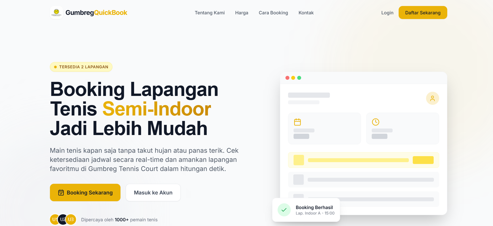
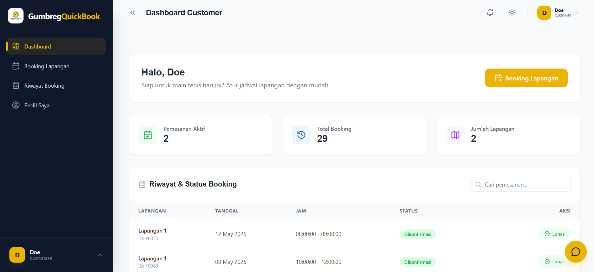
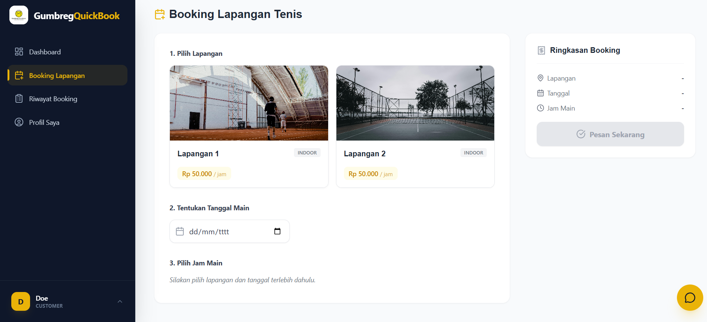
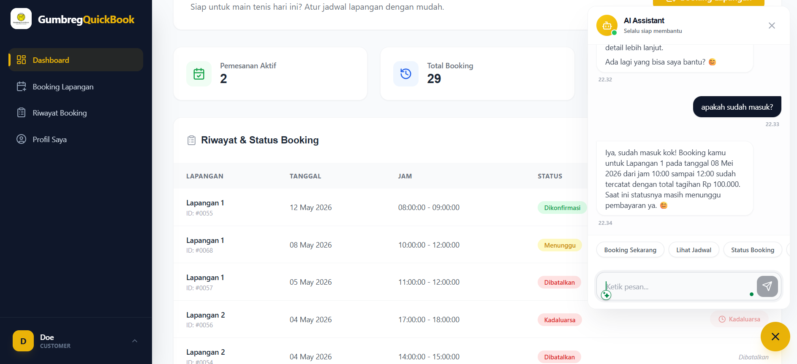

# 🎾 Gumbreg Tennis Court Booking System

<p align="center">
  
</p>

<p align="center">
  Sistem informasi penyewaan lapangan tenis berbasis Laravel yang terintegrasi dengan AI Chatbot menggunakan Gemini untuk mendukung reservasi otomatis, pengecekan jadwal, dan interaksi berbasis bahasa natural.
</p>

---

# 📌 About Project

Gumbreg Tennis Court Booking System merupakan sistem informasi berbasis web yang dikembangkan untuk membantu digitalisasi proses penyewaan lapangan tenis.

Sistem ini mengintegrasikan teknologi AI berbasis Large Language Model (LLM) menggunakan Gemini Flash untuk menghadirkan chatbot interaktif yang mampu:

* memahami bahasa natural pengguna
* melakukan reasoning
* menggunakan backend tools melalui function calling
* membantu proses reservasi secara otomatis

Project ini dikembangkan menggunakan Laravel dengan pendekatan modern AI integration dan clean architecture.

---

# 🚀 Main Features

## 🎾 Court Booking System

* Online tennis court booking
* Court schedule management
* Booking history
* Transaction management
* Pending & confirmed booking status

## 🤖 AI Chatbot Integration

* Gemini Flash integration
* Zero-shot prompting
* Natural language interaction
* Context-aware conversation
* AI-assisted customer service

## 🧠 Automatic Reasoning & Tool-Use

Chatbot mampu melakukan:

* pengecekan jadwal lapangan
* melihat detail tagihan
* membatalkan booking pending
* membantu proses reservasi

Sistem menerapkan konsep:

* Function Calling
* Tool-Use
* Automatic Reasoning
* AI Orchestration Workflow

---

# 📸 System Preview

## 🏠 Homepage

<p align="center">
  
</p>

---

## 📊 Dashboard

<p align="center">
  
</p>

---

## 🎾 Booking System

<p align="center">
  
</p>

---

## 🤖 AI Chatbot

<p align="center">
  
</p>

---

# 🏗️ AI Architecture

Sistem chatbot menggunakan pendekatan:

```text
User → Gemini AI → Tool Dispatcher → Laravel Function → AI Response → User
```

## AI Responsibilities

* intent understanding
* reasoning
* tool selection
* conversational response generation

## Laravel Responsibilities

* validation
* business logic
* database operations
* security & authorization

Pendekatan ini memungkinkan AI bertindak sebagai orchestration layer tanpa memberikan akses database secara langsung kepada model AI.

---

# 🔐 AI Tool-Use Security

Untuk menjaga keamanan sistem, implementasi AI menggunakan beberapa mekanisme proteksi:

* Tool whitelist system
* Validation layer
* Controlled function execution
* Max reasoning turns
* Protected database access
* Hallucination prevention

AI tidak dapat mengakses database secara langsung. Seluruh operasi dilakukan melalui tool backend Laravel yang telah divalidasi dan diisolasi.

---

# 🧩 Tech Stack

## Backend

* Laravel
* PHP
* MySQL

## Frontend

* Blade
* Tailwind CSS
* Alpine.js

## AI & Automation

* Gemini Flash
* Function Calling
* Automatic Reasoning & Tool-Use
* n8n Workflow Automation

## Development Tools

* Laragon
* Git & GitHub
* Visual Studio Code
* Figma

---

# ⚙️ Installation

## 1. Clone Repository

```bash
git clone https://github.com/USERNAME/REPOSITORY.git
```

## 2. Go To Project Folder

```bash
cd project-name
```

## 3. Install Dependencies

```bash
composer install
npm install
```

## 4. Copy Environment File

```bash
cp .env.example .env
```

## 5. Generate Application Key

```bash
php artisan key:generate
```

## 6. Configure Database

Edit `.env`

```env
DB_DATABASE=your_database
DB_USERNAME=root
DB_PASSWORD=
```

## 7. Run Migration

```bash
php artisan migrate
```

## 8. Start Development Server

```bash
php artisan serve
npm run dev
```

---

# 🧠 AI Workflow Example

## User Request

```text
"Apakah besok jam 7 malam masih ada lapangan kosong?"
```

## AI Reasoning

AI menentukan bahwa request membutuhkan tool:

* `cek_ketersediaan_lapangan`

## Tool Execution

Laravel melakukan:

* validasi request
* pengecekan database
* pengembalian hasil ke AI

## Final AI Response

```text
"Ya, lapangan masih tersedia untuk besok jam 19:00."
```

---

# 📚 Research Context

Project ini dikembangkan sebagai penelitian tugas akhir dengan fokus pada implementasi:

* Laravel-based information system
* AI chatbot integration
* Automatic Reasoning & Tool-Use
* Function Calling Architecture
* Conversational AI pada sistem reservasi

---

# 🎯 Development Goals

* Meningkatkan efisiensi reservasi lapangan
* Mengotomatisasi layanan pelanggan
* Mengurangi proses manual
* Mengintegrasikan AI modern ke sistem informasi berbasis web
* Meningkatkan pengalaman pengguna melalui conversational interaction

---

# 👨‍💻 Developer

Developed using Laravel & Gemini AI Integration.

---

# 📄 License

Project ini dikembangkan untuk kebutuhan penelitian dan pembelajaran.
